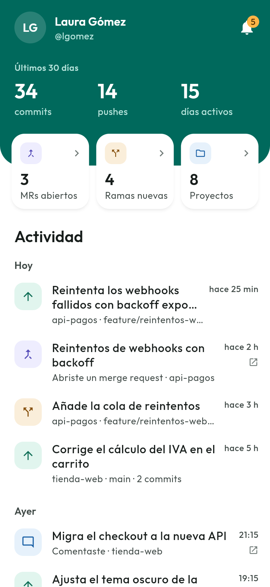
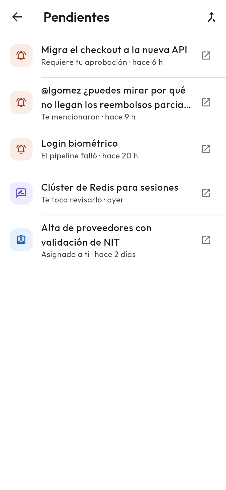
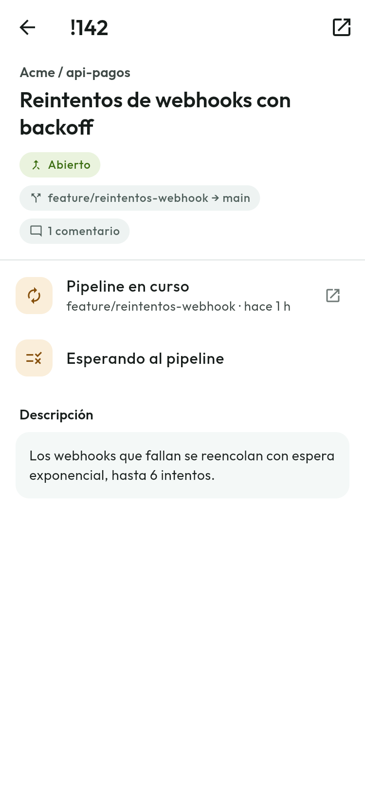
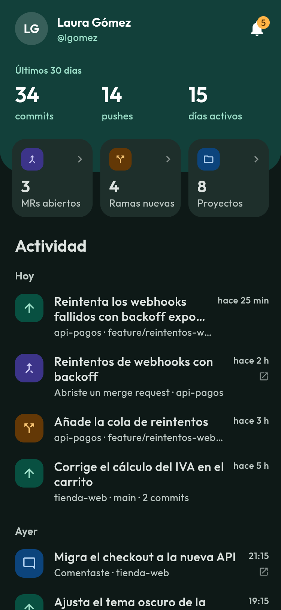

# Merged

**GitLab resumido en el móvil.** Inicias sesión con tu cuenta de GitLab y ves de
un vistazo tu informe personal: tu actividad, tus commits, tus merge requests,
tus ramas y lo que te está esperando.

<p align="center">
  
  
  
  
</p>

<sub>Capturas del modo demo, con datos ficticios.</sub>

## Qué hace

- **Resumen de los últimos 30 días:** commits, pushes y días con actividad.
- **Actividad** agrupada por día. Al tocar un push se ven sus commits reales.
- **Campana de pendientes:** aprobaciones requeridas, menciones, merge requests
  que te toca revisar o que tienes asignados. Si un mismo MR llega por varias
  vías, cuenta una sola vez.
- **Merge requests** propios, asignados y a revisar, filtrables por estado, con
  el pipeline y el diagnóstico de fusión en el detalle.
- **Ramas creadas** y **proyectos** de los que eres miembro.
- **Sin conexión**, muestra lo último que cargó y avisa de desde cuándo.
- Tema claro y oscuro. Todo lo que la app no hace se abre en GitLab.

Es de **solo lectura**: pide los permisos `read_api` y `read_user` y nada más.

## Estado

Versión 0.1 en desarrollo: Android, gitlab.com y en español. El plan de trabajo,
las decisiones tomadas y lo que falta para publicar están en
[PLAN.md](PLAN.md).

## Probarla sin cuenta

El modo demo arranca la app con datos ficticios, sin login ni red. Sirve para
ver la interfaz en el navegador, donde el login OAuth no funciona:

```bash
flutter run -d chrome -t lib/demo/main_demo.dart
```

## Ejecutarla con tu cuenta

Requiere Flutter 3.47 o superior (Dart 3.13) y un Android 7.0 o superior.

```bash
flutter pub get
flutter run
```

La app usa una aplicación OAuth de gitlab.com con PKCE y sin secreto, como
corresponde a una app móvil. Para usar una tuya, regístrala en la sección
*Applications* de tu perfil de GitLab así:

- **Redirect URI:** `dev.merged.app://callback`
- **Confidencial:** desmarcado
- **Scopes:** `read_api` y `read_user`

y pon su *Application ID* en `_clientId`, en
[`lib/core/auth/auth_service.dart`](lib/core/auth/auth_service.dart).

> [!NOTE]
> `android/app/src/main/AndroidManifest.xml` se aparta del template de Flutter
> en dos puntos que el login necesita. Están explicados en el propio archivo:
> no los pierdas al regenerar la carpeta `android/`.

## Desarrollo

```bash
flutter analyze
flutter test
```

```
lib/
  core/       API (dio), autenticación, datos y caché, modelos, tema
  features/   una carpeta por pantalla
  shared/     etiquetas, estados vacíos y de error, componentes comunes
  demo/       modo demo: datos ficticios y repositorio sin red
```

El estado va con Riverpod y los modelos se construyen a mano desde los payloads
reales de la API. Algunas decisiones:

- **Sin N+1.** La API de eventos no trae los commits de cada push. Se piden con
  `compare` solo al abrir un push, nunca al pintar la lista.
- **Caché network-first.** Se recurre al disco solo si la red falla, y entonces
  un aviso lo dice. Así los datos viejos nunca se confunden con los actuales.
- **Los vacíos son parte del diseño.** Para muchos perfiles la campana o las
  revisiones estarán vacías casi siempre, y cada pantalla explica su vacío.

## Privacidad

Merged no tiene servidor propio: se conecta directamente con gitlab.com. El
token de sesión se guarda en el almacenamiento seguro del dispositivo y solo se
envía a gitlab.com.

---

Merged no está afiliada a GitLab Inc. GitLab es una marca registrada de
GitLab Inc.
